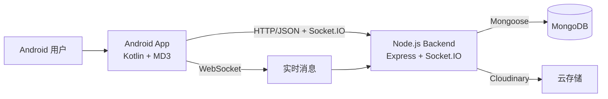
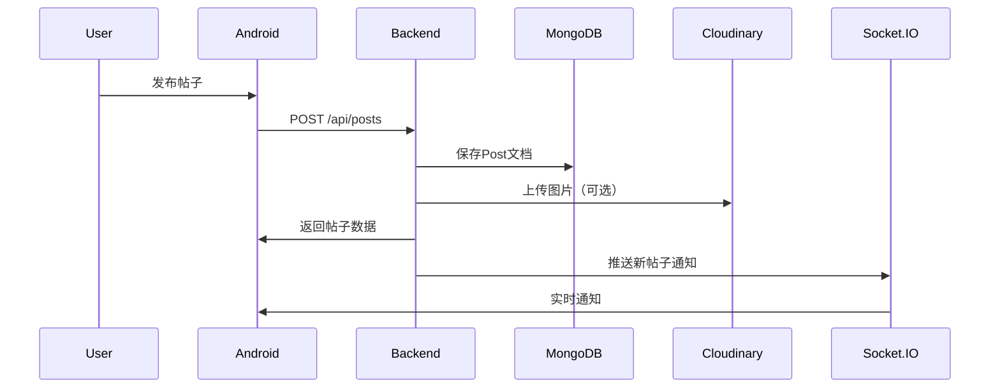
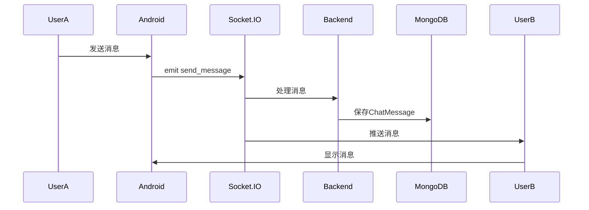

# 架构设计文档

## 1. 架构目标

本项目为移动端匿名聊天系统，目标是：

- Android 客户端（Kotlin）稳定调用后端接口
- Node.js 后端提供统一业务 API
- 使用 MongoDB 存储核心业务数据
- 实时通信支持（Socket.IO）
- 部署方案简单，便于快速上线与维护

---

## 2. 技术架构概览

- **客户端**: Android（Kotlin + Material Design 3）
- **后端**: Node.js + Express.js
- **数据库**: MongoDB（Mongoose ODM）
- **实时通信**: Socket.IO
- **认证**: JWT（jsonwebtoken）
- **部署**: 支持本地开发和云服务器部署

---

## 3. 系统架构图



---

## 4. 分层与职责

### 4.1 Android 客户端（Kotlin）

**架构模式**: MVVM（Model-View-ViewModel）

**分层结构**:
- **UI层**: Activity/Fragment + Material Design 3组件
- **ViewModel层**: 状态管理与业务编排
- **Data层**: Repository + Retrofit网络请求
- **网络层**: Retrofit2 + OkHttp3 + WebSocket客户端

**核心职责**:
- 展示帖子流、评论、通知、私信等页面
- 调用后端 API，处理加载态/错误态
- 实时消息接收与在线状态显示
- 本地缓存（Room Database）
- 图片加载（Glide/Coil）

**技术栈**:
- Kotlin协程异步处理
- Retrofit2网络请求
- WebSocket实时通信
- Material Design 3 UI组件
- Room Database本地存储

---

### 4.2 Node.js 后端

**架构模式**: MVC（Model-View-Controller）

**核心模块**:
- **Express.js**: Web框架，处理HTTP请求
- **Socket.IO**: 实时通信，消息推送
- **Mongoose**: MongoDB对象模型工具
- **JWT**: 用户认证与授权
- **Multer**: 文件上传处理

**主要功能**:
- 用户注册、登录与JWT认证
- 帖子CRUD、点赞、评论
- 通知中心与已读管理
- 私信聊天（Whisper）与实时推送
- 群聊派对（Party）功能
- 用户关注与社交关系
- 图片上传（本地存储 + Cloudinary）

**技术栈**:
- Express.js 4.x
- Socket.IO 4.x
- Mongoose 8.x
- bcryptjs密码加密
- Winston日志系统
- compression性能优化
- cors跨域支持
- express-rate-limit速率限制

---

### 4.3 MongoDB 数据层

**数据库类型**: MongoDB（文档数据库）

**核心模型**:
- `User`: 用户信息与社交关系
- `Post`: 帖子内容与互动数据
- `Comment`: 评论内容
- `Notification`: 通知消息
- `ChatMessage`: 私信消息
- `ChatRoom`: 私信房间
- `PartyRoom`: 群聊房间
- `PartyMessage`: 群聊消息

**数据特性**:
- 文档模型，灵活扩展
- ObjectId引用关系
- 数组字段（关注列表、点赞列表）
- 冗余计数优化查询
- 索引优化查询性能

---

### 4.4 实时通信层（Socket.IO）

**功能**:
- Whisper私信实时推送
- Party群聊实时消息
- 用户在线状态管理
- 房间加入/离开事件
- 消息发送/接收事件

**事件类型**:
- `join_room`: 加入聊天房间
- `send_message`: 发送消息
- `receive_message`: 接收消息
- `join_party`: 加入群聊房间
- `party_message`: 群聊消息
- `leave_party`: 离开群聊房间

---

## 5. 接口通信规范

### 5.1 HTTP API通信

**请求格式**:
- Header: `Content-Type: application/json`
- 认证: `Authorization: Bearer <JWT_TOKEN>`
- 统一返回格式:

```json
{
  "message": "操作成功",
  "data": {}
}
```

**状态码规范**:
- `200`: 成功
- `201`: 创建成功
- `400`: 参数错误
- `401`: 未授权
- `404`: 资源不存在
- `500`: 服务器错误

### 5.2 WebSocket通信

**连接地址**: `ws://server-url`

**认证方式**:
- 连接时携带JWT Token
- 服务端验证Token有效性

**消息格式**:
```json
{
  "event": "事件类型",
  "data": {
    "roomId": "房间ID",
    "content": "消息内容"
  }
}
```

---

## 6. 部署架构

### 6.1 本地开发部署

**环境要求**:
- Node.js LTS版本
- MongoDB本地安装
- Android Studio开发环境
- 手机和电脑连接同一WiFi网络

**启动步骤**:
```bash
# 后端启动（确保绑定到0.0.0.0以允许内网访问）
cd backend
npm install
npm run dev

# 查看电脑内网IP地址（Windows）
ipconfig
# 例如：IPv4地址为 192.168.1.100

# Android客户端
# 1. 修改Retrofit的BASE_URL为 http://192.168.1.100:3000/api/
# 2. 在Android Studio中运行项目
```

**内网访问说明**:
- 后端服务默认运行在 `http://localhost:3000`
- 需要配置Express监听 `0.0.0.0` 以接受内网连接
- 移动端通过电脑的内网IP地址（如 `http://192.168.x.x:3000`）访问后端
- Socket.IO WebSocket同样通过内网IP连接

---

## 7. 安全架构

### 7.1 认证与授权

**JWT认证流程**:
1. 用户注册/登录
2. 服务端生成JWT Token（7天有效期）
3. 客户端存储Token（SharedPreferences加密）
4. 每次请求携带Token
5. 服务端验证Token并提取用户ID

**密码安全**:
- bcryptjs加密存储
- 最少6位密码长度
- Pre-save hook自动加密

### 7.2 API安全

**安全措施**:
- CORS跨域控制
- express-rate-limit速率限制
- 输入验证（长度、格式）
- 文件类型限制（只允许图片）
- 错误信息脱敏

**敏感数据保护**:
- 密码字段不返回（.select('-password'))
- JWT密钥环境变量存储
- MongoDB连接凭据加密

---

## 8. 性能优化架构

### 8.1 后端性能优化

**优化措施**:
- Gzip压缩（compression）
- MongoDB索引优化
- 冗余计数减少查询
- 连接池管理
- 响应时间监控（response-time）
- Winston日志系统

### 8.2 前端性能优化

**优化措施**:
- 图片懒加载（Glide/Coil）
- RecyclerView优化
- 协程异步处理
- 本地缓存（Room Database）
- 网络请求优化（Retrofit缓存）

### 8.3 数据库性能优化

**优化措施**:
- 单字段索引（username、createdAt）
- 复合索引（userId+createdAt）
- 数组索引（following、likedBy）
- 冗余字段（likes、commentCount）
- 分页查询（skip + limit）

---

## 9. 监控与日志架构

### 9.1 后端监控

**监控指标**:
- 请求响应时间
- API调用频率
- 错误率统计
- 内存使用情况
- MongoDB连接状态

**日志系统**:
- Winston日志记录
- 日志分级（info、warn、error）
- 日志文件存储
- 请求日志记录

### 9.2 性能指标接口

**健康检查**: `GET /health`
```json
{
  "status": "healthy",
  "uptime": "3600s",
  "memory": {
    "rss": "50MB",
    "heapUsed": "30MB"
  }
}
```

**性能指标**: `GET /metrics`
```json
{
  "requests": {
    "total": 1000,
    "averageTime": "50ms"
  }
}
```

---

## 10. 扩展架构设计

### 10.1 微服务演进方向

**可拆分模块**:
- 认证服务（Auth Service）
- 帖子服务（Post Service）
- 聊天服务（Chat Service）
- 通知服务（Notification Service）
- 用户服务（User Service）

**通信方式**:
- REST API
- 消息队列（RabbitMQ/Kafka）
- gRPC高性能通信

### 10.2 缓存架构

**Redis缓存应用**:
- 热门帖子缓存
- 用户在线状态缓存
- 会话Token缓存
- 通知计数缓存

### 10.3 消息队列架构

**异步处理场景**:
- 通知批量发送
- 图片处理任务
- 数据统计分析
- 定时任务调度

---

## 11. 数据流架构

### 11.1 帖子发布流程



### 11.2 私信聊天流程



---

## 12. 技术选型理由

### 12.1 MongoDB vs MySQL

**选择MongoDB原因**:
- 社交应用数据结构灵活
- 数组字段天然支持（关注列表、点赞列表）
- 文档模型与JSON格式匹配
- 开发效率更高
- 无需预定义表结构

### 12.2 Express.js vs 其他框架

**选择Express原因**:
- 轻量级、灵活
- 中间件生态丰富
- 社区支持强大
- 学习成本低
- 性能优秀

### 12.3 Socket.IO vs WebSocket

**选择Socket.IO原因**:
- 自动重连机制
- 心跳检测
- 房间管理
- 广播消息
- 兼容性更好

---

## 13. 后续演进方向

### 13.1 短期优化（1-3个月）
- 引入Redis缓存
- 完善单元测试
- API文档自动生成（Swagger）
- 性能监控仪表盘

### 13.2 中期演进（3-6个月）
- 微服务拆分
- 消息队列引入
- 容器化部署（Docker）
- CI/CD完善

### 13.3 长期规划（6-12个月）
- 服务网格（Kubernetes）
- 分布式数据库
- AI推荐系统
- 大数据分析平台