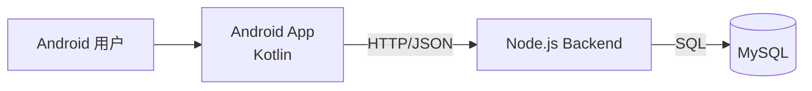

# 架构设计文档

## 1. 架构目标

本项目为移动端匿名聊天系统，目标是：

- Android 客户端（Kotlin）稳定调用后端接口
- Node.js 后端提供统一业务 API
- 使用 MySQL 存储核心业务数据
- 部署方案尽可能简单，便于快速上线与维护

---

## 2. 技术架构概览

- 客户端：Android（Kotlin）
- 后端：Node.js（HTTP API）
- 数据库：MySQL
- 部署：单机最小化部署（Node.js 进程 + MySQL 服务）

---

## 3. 系统架构图



---

## 4. 分层与职责

### 4.1 Android 客户端（Kotlin）

建议分层：
- UI 层：Activity/Fragment/Compose 页面
- ViewModel 层：状态管理与业务编排
- Data 层：Repository + Network(DataSource)

职责：
- 展示帖子流、评论、通知、私信等页面
- 调用后端 API，处理加载态/错误态
- 本地仅做必要缓存，不直连数据库

### 4.2 Node.js 后端

当前后端已实现：
- 健康检查与基础连通接口
- 帖子/评论/点赞
- 通知读取与已读
- 私信收件箱、发送、已读
- 个人摘要与最近相遇

职责：
- 统一参数校验与错误处理
- 事务维护计数与关系一致性
- 提供可扩展的业务接口

### 4.3 MySQL 数据层

核心实体：
- `users`, `posts`, `comments`
- `post_likes`, `comment_likes`
- `notifications`, `private_messages`
- `topics`, `post_topics`, `emotions`
- `encounters`

职责：
- 保证关系完整性（外键/唯一约束）
- 支撑高频查询（时间线、收件箱、通知）

---

## 5. 接口通信规范

客户端与后端通过 HTTP + JSON 通信：

- Header：`Content-Type: application/json`
- 用户标识：`X-User-Id`（当前阶段用于模拟用户）
- 统一返回 JSON（成功/失败结构清晰）

建议统一响应格式（后续可迭代）：

```json
{
  "code": 0,
  "message": "ok",
  "data": {}
}
```

---

## 6. 最简单部署方案（推荐）

目标：一台云服务器快速跑起来。

### 方案说明

- 服务器安装：
  - Node.js LTS
  - MySQL 8.x
  - Nginx（可选，做反向代理）
- 后端以 `pm2` 常驻运行
- MySQL 本机部署，初始化执行 `backend/sql/init.sql`

### 最小部署步骤

1. 上传代码到服务器。
2. 在 `backend` 目录执行：
   - `npm install`
   - 配置 `.env`（数据库连接、端口）
3. 导入数据库脚本 `backend/sql/init.sql`。
4. 使用 `pm2 start src/index.js --name chat-backend` 启动后端。
5. （可选）Nginx 反代到 Node.js 端口并开启 HTTPS。

这个方案成本最低、理解最简单，适合作业与 MVP。

---

## 7. 安全与运维建议（轻量）

- `.env` 不入库，密码不硬编码
- 生产环境限制 MySQL 远程访问
- 增加基础日志（请求路径、耗时、状态码）
- 定期备份 MySQL 数据

---

## 8. 后续演进方向

- 增加正式鉴权（JWT）
- 增加接口限流与风控
- 引入容器化（Docker Compose）便于标准化部署
- 完善自动化测试与监控告警
