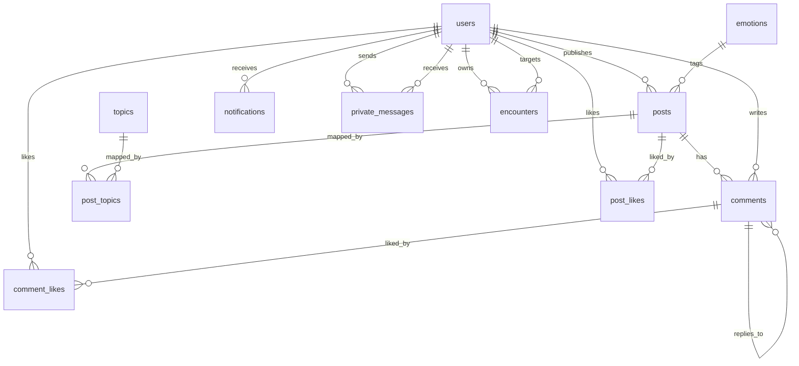

# 数据库设计文档（含 ER 图）

## 1. 设计目标

本数据库用于“匿名树洞聊天系统”后端，覆盖以下核心业务：

- 用户匿名身份管理
- 帖子发布与话题归类
- 评论与点赞互动
- 通知中心
- 私信与“相遇”关系沉淀

数据库类型：MySQL 8.x（字符集 `utf8mb4`，排序规则 `utf8mb4_unicode_ci`）。

---

## 2. ER 图（逻辑模型）

---

## 3. 表结构设计

### 3.1 `users`（用户表）

- 主键：`id`
- 唯一键：`anonymous_name`
- 核心字段：
  - `anonymous_name`：匿名昵称
  - `auth_password`：认证密码（仅用于登录）
  - `avatar_color`：头像主题色
  - `joined_at`：加入时间
  - `status`：用户状态
- 说明：作为大多数业务表的外键来源。

### 3.2 `emotions`（情绪字典表）

- 主键：`id`
- 唯一键：`code`
- 核心字段：`code`, `display_name`
- 说明：用于帖子情绪分类，避免文本重复存储。

### 3.3 `topics`（话题表）

- 主键：`id`
- 唯一键：`name`
- 核心字段：`name`, `is_hot`
- 说明：支持热门话题展示与帖子归类。

### 3.4 `posts`（帖子表）

- 主键：`id`
- 外键：
  - `user_id -> users.id`
  - `emotion_id -> emotions.id`
- 核心字段：
  - `content`（500 字以内）
  - `allow_comments`、`is_public`
  - `likes_count`、`comments_count`（冗余计数，提升查询性能）
  - `created_at`、`updated_at`
- 索引：
  - `idx_posts_created_at (created_at)`
  - `idx_posts_emotion_created (emotion_id, created_at)`

### 3.5 `post_topics`（帖子-话题关联表）

- 复合主键：`(post_id, topic_id)`
- 外键：
  - `post_id -> posts.id ON DELETE CASCADE`
  - `topic_id -> topics.id ON DELETE CASCADE`
- 说明：实现帖子与话题多对多关系。

### 3.6 `comments`（评论表）

- 主键：`id`
- 外键：
  - `post_id -> posts.id ON DELETE CASCADE`
  - `user_id -> users.id`
  - `parent_comment_id -> comments.id ON DELETE SET NULL`
- 核心字段：
  - `floor_no`：楼层号
  - `content`（300 字以内）
  - `likes_count`
  - `created_at`
- 索引：
  - `idx_comments_post_created (post_id, created_at)`
  - `idx_comments_parent (parent_comment_id)`

### 3.7 `post_likes`（帖子点赞表）

- 复合主键：`(post_id, user_id)`（天然去重）
- 外键：
  - `post_id -> posts.id ON DELETE CASCADE`
  - `user_id -> users.id ON DELETE CASCADE`
- 核心字段：`created_at`

### 3.8 `comment_likes`（评论点赞表）

- 复合主键：`(comment_id, user_id)`（天然去重）
- 外键：
  - `comment_id -> comments.id ON DELETE CASCADE`
  - `user_id -> users.id ON DELETE CASCADE`
- 核心字段：`created_at`

### 3.9 `encounters`（相遇关系表）

- 主键：`id`
- 唯一键：`uq_encounters_pair (user_id, target_user_id)`
- 外键：
  - `user_id -> users.id ON DELETE CASCADE`
  - `target_user_id -> users.id ON DELETE CASCADE`
- 核心字段：`met_at`
- 说明：记录用户之间“最近一次相遇”时间，可用于“最近联系/遇见的人”。

### 3.10 `notifications`（通知表）

- 主键：`id`
- 外键：`user_id -> users.id ON DELETE CASCADE`
- 核心字段：
  - `type`：通知类型（如 `post_like` / `comment` / `comment_reply`）
  - `ref_id`：关联业务对象 ID
  - `payload`：JSON 扩展信息
  - `is_read`：已读标记
  - `created_at`
- 索引：
  - `idx_notifications_user_read (user_id, is_read, created_at)`

### 3.11 `private_messages`（私信表）

- 主键：`id`
- 外键：
  - `sender_user_id -> users.id ON DELETE CASCADE`
  - `receiver_user_id -> users.id ON DELETE CASCADE`
- 核心字段：
  - `content`（500 字以内）
  - `is_read`
  - `created_at`
- 索引：
  - `idx_private_messages_pair_time (sender_user_id, receiver_user_id, created_at)`
  - `idx_private_messages_receiver_read (receiver_user_id, is_read, created_at)`

### 3.12 `user_sessions`（用户会话表）

- 主键：`id`
- 唯一键：`token`
- 外键：`user_id -> users.id ON DELETE CASCADE`
- 核心字段：
  - `token`：Bearer Token
  - `is_active`：会话是否有效
  - `created_at`：创建时间
- 索引：
  - `idx_user_sessions_user_active_created (user_id, is_active, created_at)`
- 说明：用于认证会话，不与业务通知混用。

---

## 4. 关系与基数说明

- 用户与帖子：`1:N`
- 用户与评论：`1:N`
- 帖子与评论：`1:N`
- 评论自关联（回复）：`1:N`（父评论可为空）
- 帖子与话题：`N:M`（通过 `post_topics`）
- 用户与帖子点赞：`N:M`（通过 `post_likes`）
- 用户与评论点赞：`N:M`（通过 `comment_likes`）
- 用户与通知：`1:N`
- 用户与私信：发送 `1:N`，接收 `1:N`
- 用户与相遇记录：`1:N`（面向目标用户）
- 用户与会话：`1:N`

---

## 5. 约束与一致性设计

- 所有核心业务关系均通过外键保证引用完整性。
- 关联表采用复合主键防止重复点赞/重复关联。
- 多处使用 `ON DELETE CASCADE`，确保主记录删除后关联数据自动清理。
- 评论父子关系使用 `ON DELETE SET NULL`，避免删除父评论后整棵回复链丢失。
- 冗余计数字段（`likes_count`, `comments_count`）用于性能优化，需在业务事务中维护。

---

## 6. 索引设计与性能考虑

- 时间线类查询：`posts.created_at`、`comments(post_id, created_at)`。
- 分类筛选：`posts(emotion_id, created_at)`。
- 通知中心：`notifications(user_id, is_read, created_at)`。
- 私信收件箱/会话：`private_messages(receiver_user_id, is_read, created_at)` 与 `(sender_user_id, receiver_user_id, created_at)`。

设计原则：优先覆盖高频读路径，避免全表扫描。

---

## 7. 规范化说明

- 字典数据（情绪、话题）独立建表，满足复用与一致性。
- 多对多关系拆分为中间表，满足第三范式。
- 兼顾读性能，在帖子与评论表保留可控冗余统计字段。

---

## 8. 初始化与测试数据说明

`backend/sql/init.sql` 已包含：

- 库与表结构创建脚本
- 基础字典数据（`emotions`, `topics`）
- 示例用户、帖子、评论、通知、私信数据

可用于本地联调、接口验收与演示。
